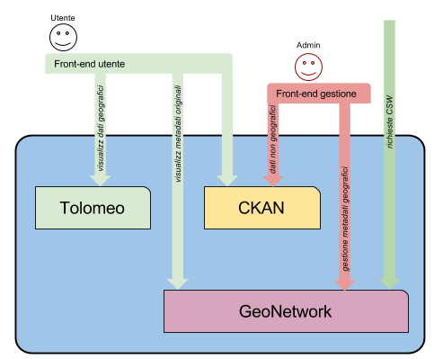

.. _cercogenericnode:

Generic node
############

Here you can see the interaction of external peers toward a CERCO node.

Such use cases are generically valid for all the nodes in the structure:
 - CKAN is used as the main data container and offers the frontend to the use
 - GeoNetwork provides access mainly to :term:`CSW` requests and for users who need to visualize spatial metadata 
   in their original format. 
 - Tolomeo provides the frontend for visualizing geographic data.     
 

Note that spatial metadata in GeoNetwork are replicated (in a somewhat simplified way) into CKAN. 
The replication procedure may vary according to the node specialization (partner node or hub; 
such details will be explained in **ADD ref HERE**).

Also note that GeoNetwork is not hidden or protected in any way; it may be accessed publicly, 
but we're not advertising its URL.  

Users
-----

Users are the final consumers of the data.

Their main frontend is CKAN, and they will use Tolomeo when previewing spatial data.

They may be accessing GeoNetwork directly if they need detailed information about a dataset's metadata source.
In this case a customized view in GeoNetwork will be used on the specified metadata; the search capabilities
of GeoNetwork will not be used.

Data admins
-----------

Data administrators will login into CKAN to create and publish non-spatial datasets.
Spatial datasets will be created in GeoNetwork. 

CSW clients
-----------

CSW services will be provided by GeoNetwork. 

