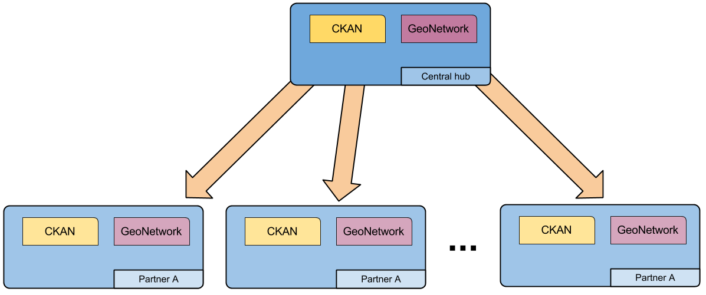
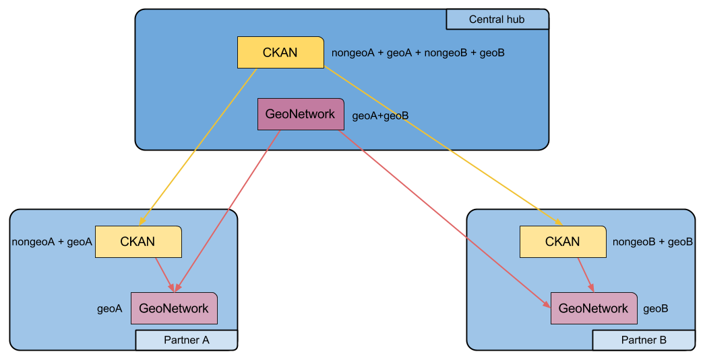

.. _cerconetworkarch:

CERCO network
#############

The CERCO architecture envisages a set of partner nodes and a central hub gathering informations from all of them.

   
Each partner node is complete in itself, and can be queried by users (using CKAN) and by CSW client (using GeoNetowrk),
publishing all the available local data.

The CERCO hub is the node that can be queried for any data belonging to any partner node.

In particular, the CKAN instance on the hub will hold all the data (spatial and non-spatial) coming from all the partner nodes,
while the GeoNetwork on the hub will hold all the spatial data.   

Harvesting flows
----------------

One configuration difference between a partner node and the central hub is that the hub CKAN will not harvest its local
GeoNetwork instance, but will harvest all the partner CKAN instances instead.

Also the GeoNetwork instance in the hub will have its data ingested in a different way with respect to the GeoNetwork in 
the partner nodes. While spatial data in the partner nodes are added and edited directly in the GeoNetwork metadata editor,
the GeoNetwork instance in the hub will harvest its data from each partner node.   

   
This harvesting configuration avoids to have duplicated metadata in the structure:

- The *CKAN instance in a partner node* has to harvest its local GeoNetwork, so it will contain both spatial and non-spatial data.
- The non-spatial data are only contained in the CKAN instance, so the *CKAN on the hub* will harvest each single partner CKAN.
- At this point, the CKAN on the hub will already contain all spatial and non-spatial data, and does not need to harvest the 
  local GeoNetwork. 
- In order for the *hub GeoNetwork* to contain all the metadata from the partner nodes, it will have to harvest them 
  from each partner GeoNetwork.     

There are some drawbacks to this configuration:

- GeoNetwork instances on partner nodes are harvested twice: by the local CKAN instance and by the hub GeoNetwork;
- while it is possible to add datasets at hub-level in CKAN, it will be not be possibile to add new metadata records in 
  the hub GeoNetwork, since they won't be mirrored (harvested) into the hub CKAN.
    