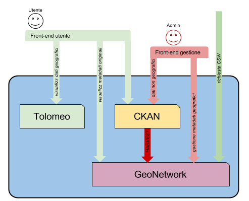

.. _cercopartnernode:

Partner node
############

In partner nodes, the CKAN instance is configured in order to harvest metadata from GeoNetwork; 

  
It means that 

- users will be able to search for both spatial and non-spatial using only CKAN
- CSW peers will only be able to search for spatial records
    
   
Internal harvesting
-------------------

CKAN harvests metadata in GeoNetwork using CSW protocol. 

By harvesting metadata, CKAN transforms GeoNetworks metadata and ingest them along with 
the non-spatial dataset.        
More details about how metadata are translated into CKAN datasets are in :ref:`gnckanmapping`. 

Harvesting procedures are run every 15 minutes.

At every run CKAN queries all the metadata in GeoNetwork and

- new metadata are imported into CKAN
- modified metadata are updated in CKAN
- metadata removed in GeoNetowrk will be removed in CKAN as well. 

CKAN categories
'''''''''''''''

Datasets, when first imported from GeoNetwork, are not related to any category.
  
CKAN administrators can bind an imported dataset to any category; 
this binding will be preserved if the dataset is updated after a modification in GeoNetwork. 
 
Tags
'''' 

As described in :ref:`gnckanmapping`, keywords in metadata are added as :term:`tag` s in CKAN.
Furhtermore in the harvesting setup more tags can be defined; for dataset harvested from GeoNetwork
we will be adding the tag "*Geografico*" to categorise spatial datasets.
 
    