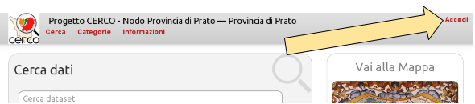
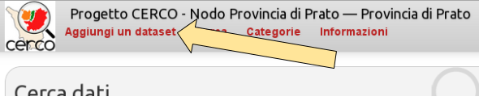
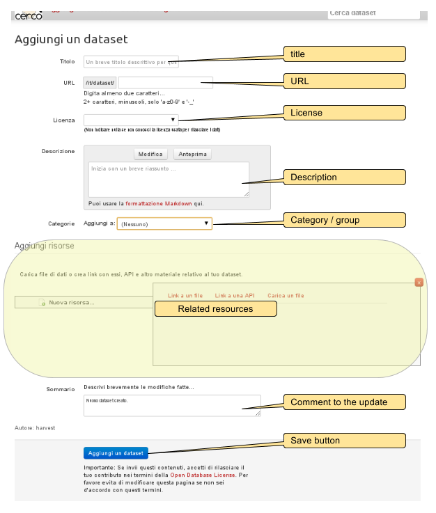

.. _ckanusercreatedataset:

################
Create a dataset
################

We'll explain here how to create new datasets in CKAN. Such dataset will be non-geographic; if you need info about the creation of
geographic dataset please refer to the provided GeoNetwork documentation and to the :ref:`gnckaninteract` documentation.


In order to create a new dataset, you need to log into CKAN. The administrator should have provided 
the credentials to log in.





Once logged in, press the "*create new dataset*" link/button.




Editing
-------

This is the form for adding (and updating) a dataset: 



These are the pre-defined fields you have to compile:

 Title
    This is the main title of the dataset. Should be kept as concise as possibile.    
 URL
    The final part of URL which will define the dataset's own URL. You don't need to 
    explicitly set it, since it will be automatically created using the *title*. 
    Edit it if you have specific needs (e.g. a given standard for dataset URLs).
 License
    The license for the distribution/access of the data. You may not edit this field if unsure.
    This is the list of the available license:
      
    .. figure:: ../../images/ckan_license_dropdown_crop.png
       :align: center

 Description
    A text that adds some more information about the dataset content. You can also 
    have `markdown formatting <http://daringfireball.net/projects/markdown/syntax>`_ in the text.
 Category
    Bind the dataset to one of the existing user defined *category*.
 Related resources
    See :ref:`ckanusercreateresource`.

There are some other info you can add to a dataset, even custom stuff, but you will only be able to edit them once the 
basic information are entered. See :ref:`datasetfurtherinfo`.

Saving
------

Once you have filled the fields you need, you can add a note to the changes (see :ref:`createdatasetversioning`) and then
press the "*Add dataset*" button.  


.. _createdatasetversioning:

Versioning
``````````
CKAN does save the history of the changes made to datasets. For every change you may associate a comment 
to the changes you made.
You can add such comment to the first revision as well (the revision of the initial creation of the dataset). 

