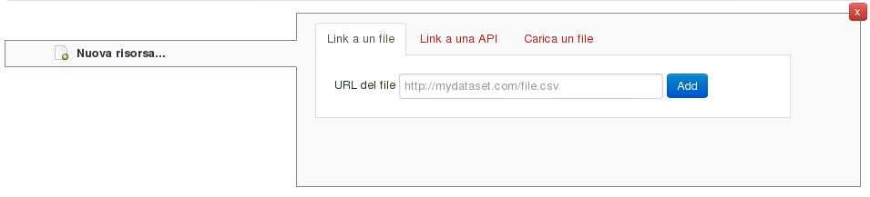
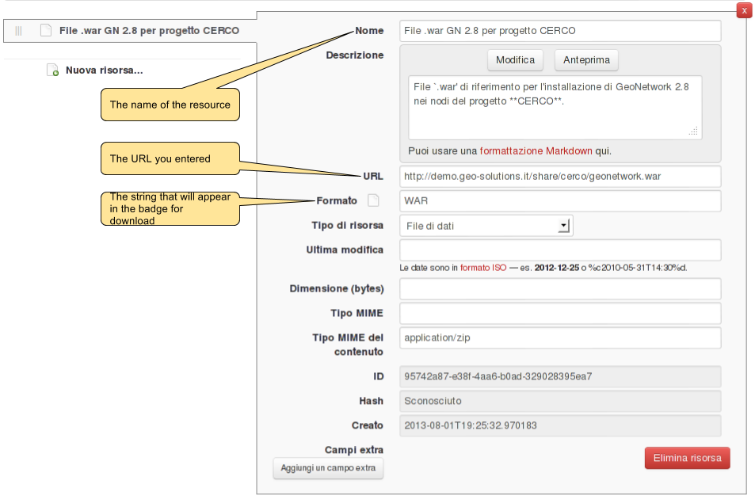

.. _ckanusercreateresource:

Adding resources
################

Add a resource to a dataset
---------------------------

A resource in CKAN documents data (a file) or a service (a URL).
 
The first step when adding a resource is to tell CKAN if you are referring to a file on the internet, a service URL
ora a file that will be hosted inside the CKAN instance.

   
Once selected the remote file and pressed the "*Add*" button, you'll have to fill in some basic info:

 

Adding custom information
-------------------------

The "*extra fields*" at the bottom of the page will allow you to add custom key/value pairs associated to the
resource, in the same way as was explained in :ref:`addingdatasetextrafields`.  