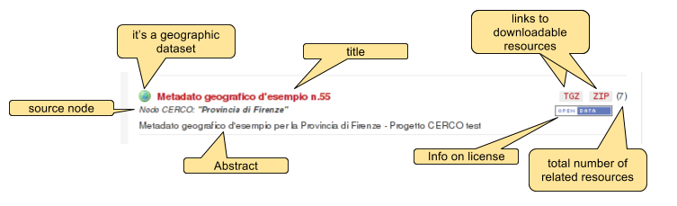
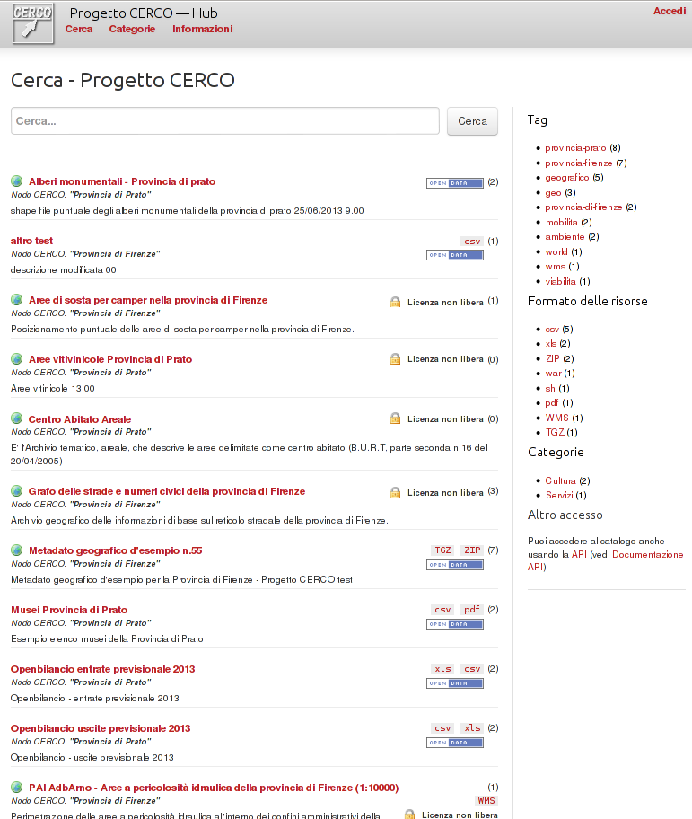
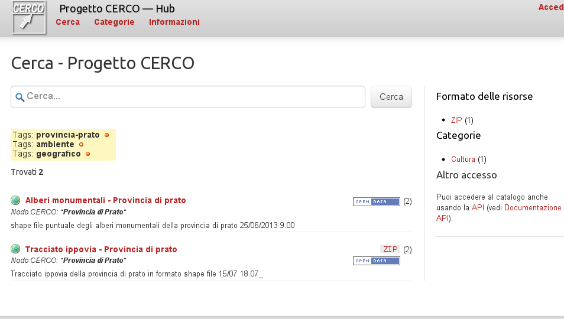

.. _ckannavdatasetlist:

Dataset list
============

The dataset list page shows a list of datasets. This list can be the total list of all contained dataset,
or may be a filtered list.

In such list you can usually see: 
 - the title of the dataset, 
 - a short abstract, 
 - the license of the dataset
 - the links to the downloadable data.

As a customization for the CERCO project, you can also see:
 - an icon if a geographic dataset
 - the name of the node where the original data comes from (this info is only presented on the hub: partner nodes do not 
   import data from other nodes)
 - the total number of resources associated to the dataset.
 
This is how a dataset entry is presented in the dataset list: 

Here an example of how the dataset list will be presented:
  

Filtering
---------

On the right side of the page, you can see the list of all the :term:`tag` s, resource format and category in the current set of datasets.

By clicking on one of those entries you may further filter the current set of metadata.
For instance, if you click on tag "provincia-prato", you'll only get the datasets which are tagged this way; you may 
iterate the filtering in order to restrict your research.   

You may end up with this kind of result:

Once you have found the dataset you are looking for, you can then click on it to view its details in the :ref:`ckannavdatasetview` page.