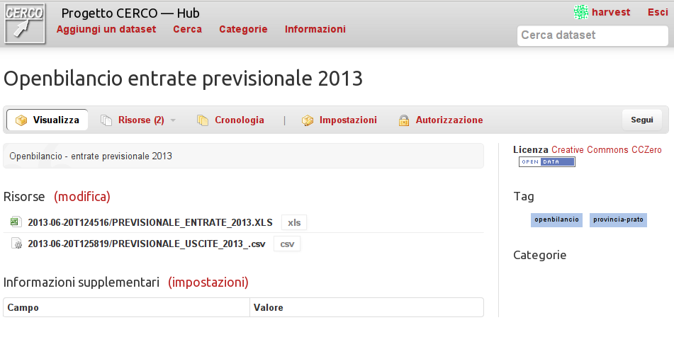
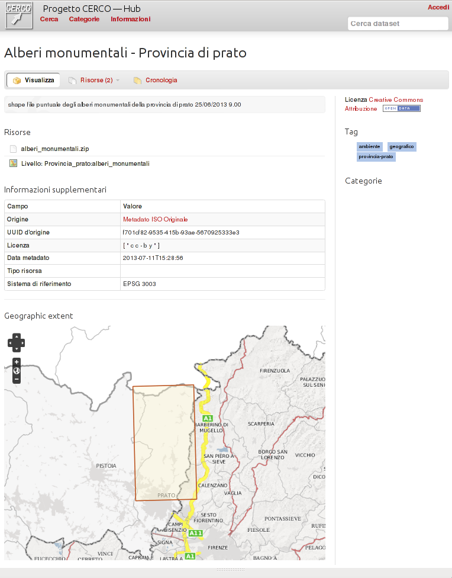

.. _ckannavdatasetview:

Dataset details
===============

In the dataset detail page you can see all the details added to the dataset.

In this minimal example, there are only 
 - title and description of the data
 - licence information
 - related tags 
 - associated resources and their content type

Since the title is explicative enough, the attached data is perfectly usable.  

By clicking on a resource title, the :ref:`ckannavresourceview` page will be visualized.

Spatial dataset
---------------

The following example shows a spatial dataset (a dataset containing spatial information and meta-information).

This kind of metadata are created into CKAN usually only importing them from a spatial catalog.
The set of visible metadata has been customized in order to be restricted to only the most important info.

The extra information contain data about:
 - a link to the original metadata in the source catalog
 - the license text in the original metadata (in case it's not parsed properly by CKAN)
 - the spatial reference system
 - the data bounding box, represented graphically in a map.   

