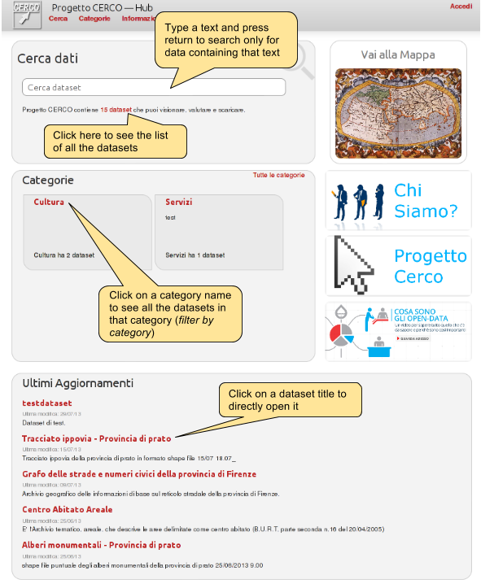

.. _ckannavmain:

Main page
'''''''''

This is the landing page in each node.

Content-wise, here you have the ability to perform a research on data, you may call a paginated list of all the datasets,
a list of the dataset in a given category, and other custom information.

When performing a search, or any other request that would show a list of datasets, you are redirected to 
the :ref:`ckannavdatasetlist` page. 

Here a sample of a CKAN main page, with some pointers to the main functionalities: 

   