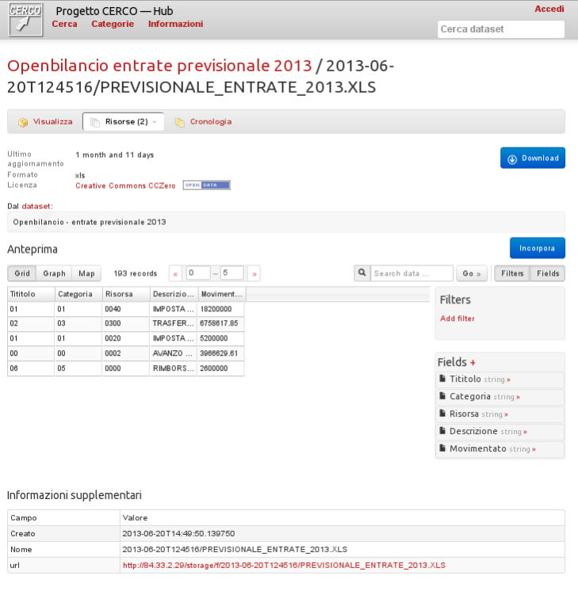
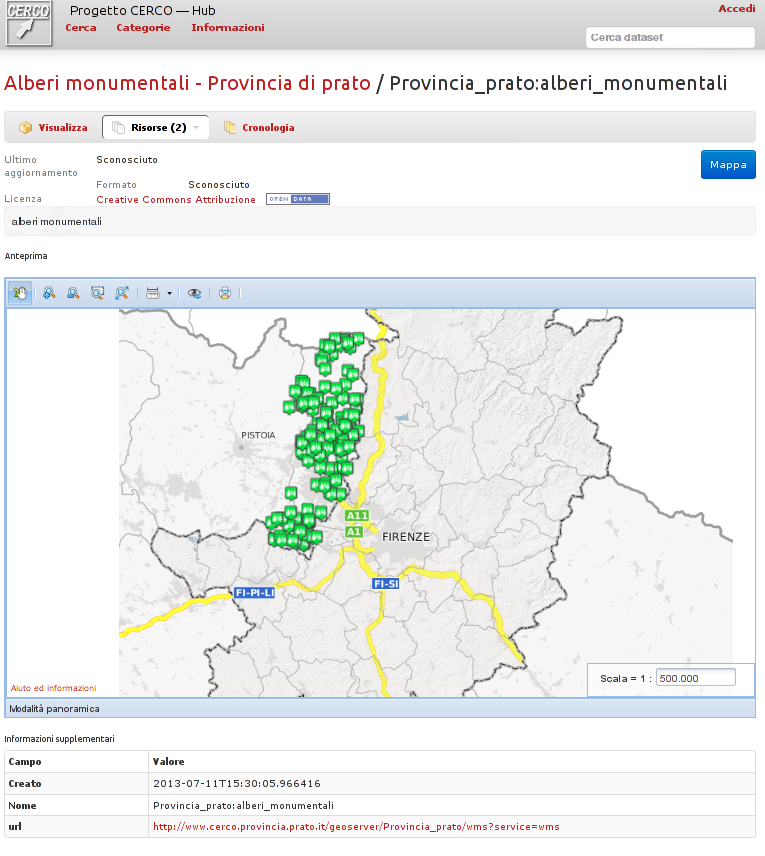

.. _ckannavresourceview:

Resource details
================

The page showing the resource details offers information about the data (such as license, creation date, ...),
and how to obtain the related data.

If possible, data will also be previewed if the data type is recognized by CKAN.  

Here's an example how an XLS (MS Excel) file can be previewed and processed in CKAN:  

Note that there is a "*Download button*" in the upper right part of the page that will allow the user to get the data.  

.. _ckannavresourceviewspatial:

Spatial resources
-----------------

If the resource is a :term:`WMS` layer, the information will be forwarded to an embedded :term:`Tolomeo` instance for
showing a preview of the layer. 

In this case you can't directly download the data from this resource (the metadata administrator 
may have provided both a :term:`WMS` endpoint **and** a shapefile, but, beside being associated to the same 
dataset, all resources are independent each other).

The upper right button ("*Map*") will open the WMS layer in a full featured :term:`Tolomeo` map client.

