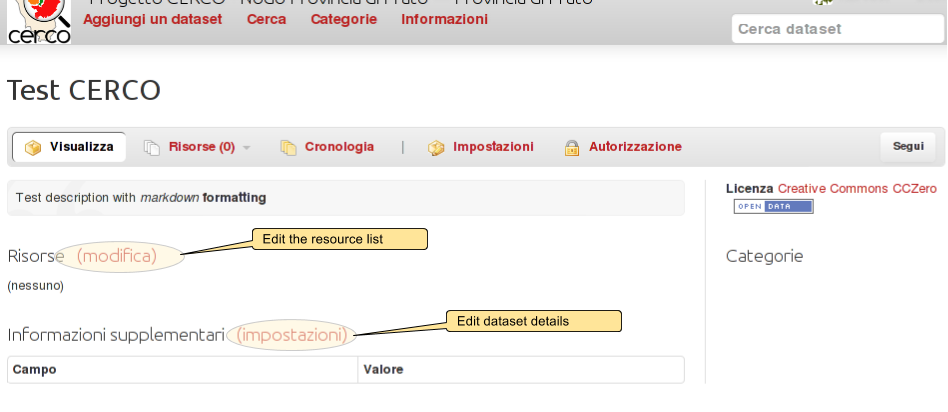
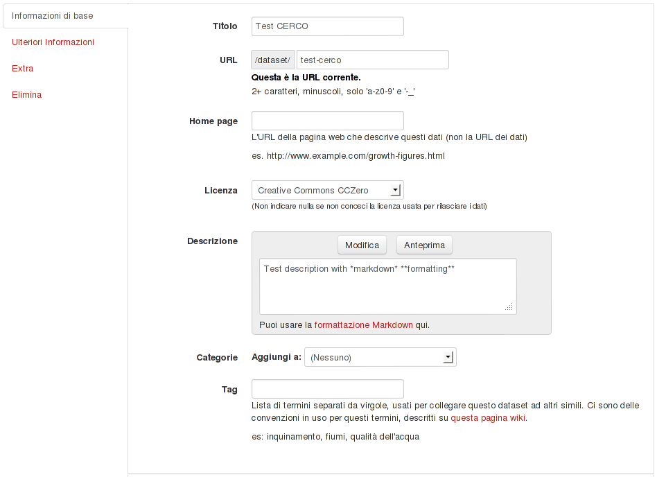
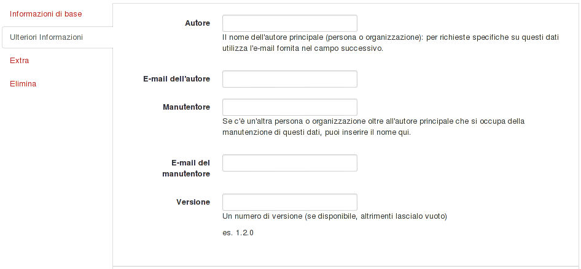
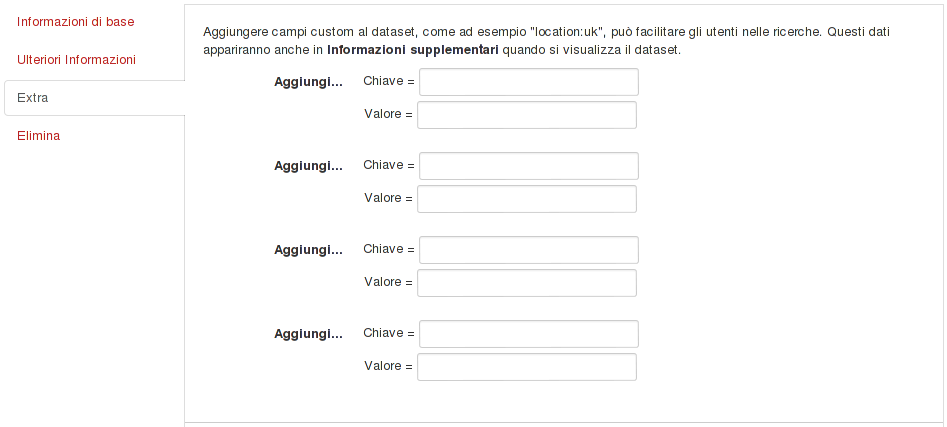
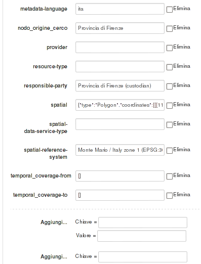

.. _datasetfurtherinfo:

==================
Updating a dataset
==================

The initial dataset creation only asks you for basic information.

Once the dataset is created, you can add more information.

This is a dataset just created with a minimal set of information (title, description, license and no resources associated):
 

You will be able to update the exising data only when logged in as a known user.

There are links to pages for updating the dataset details and for modify the associated resources 
(see :ref:`ckanusercreateresource` for info about the latter).

Updating base data
------------------

Here you have almost the same set of data as when creating the dataset from scratch.

The only difference is the "*tags*" field, where you can add one or more :term:`tag` s to the dataset.  

Updating other info
-------------------
The "*other info*" tab contains some fields about people responsible for the dataset, and for an external version number 
(i.e. not related to the internal versioning system).

.. _addingdatasetextrafields:

Adding custom info
------------------
If you need to store some info in the dataset but you can't find the proper place for it, you can use the extra fields.

Extra fields are simply a set of key/value pair that may store string values. 
 

As example, these are some extra fields used in the CERCO nodes:
 - ``gn_url`` = ``http://84.33.2.29/geonetwork``
 - ``nodo_origine_cerco`` = ``Provincia di Prato``
 

 
 
.. hint:: Please note that keys should be unique inside a dataset. 

It means that you can't have extras with duplicated keys, like this
 - entry = ThisIsAnEntry
 - entry = ThisIsAnotherEntry

          
