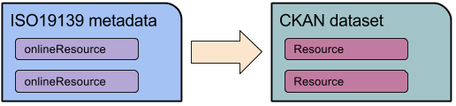
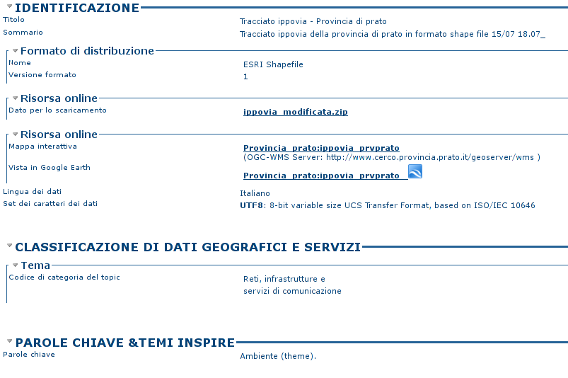
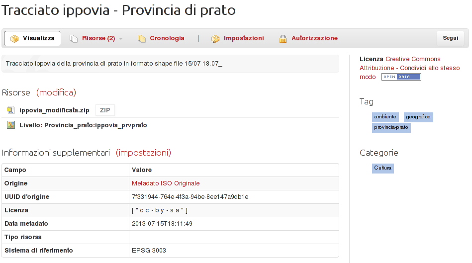

.. _mapping19139:

Mapping ISO19139 into CKAN datasets
###################################

Metadata harvested by CKAN from GeoNetwork are documents in XML format, that follow the ISO19139 schema.
The format is quite complex, and a task to do when importing such data into CKAN is to transform them into
the set of information that constitute a CKAN dataset.
 
A first high level mapping is about datasets and resources:    

This is possible since the concept of online resource in ISO19139 is identical to CKAN.

The process of mapping each field from ISO19139 to CKAN is quite detailed, since it requires
to define the position in the XML file of each required information 
(you can find the code that performs most of this mapping in https://github.com/geosolutions-it/ckanext-spatial/blob/1.8_cerco/ckanext/spatial/model/harvested_metadata.py).

The field defined in CKAN are anyway very few compared to what can be expresses in ISO19139.
So what is done is:

#. handle the fields that can be mapped directly in CKAN dataset model (title, description, author, ...)
#. store some important fields that have to counterparts in CKAN dataset model as custom fields 
   (see :ref:`addingdatasetextrafields`). Here a sample subset of some extra fields:
   
     .. figure:: ../../../images/ckan_extras_example.png
#. do not import other very specific fields.

Here a sample of how a metadata in GeoNetwork is transferred into CKAN:

Dataset "ippovia" in GeoNetwork:

Dataset "ippovia" in CKAN:
   

